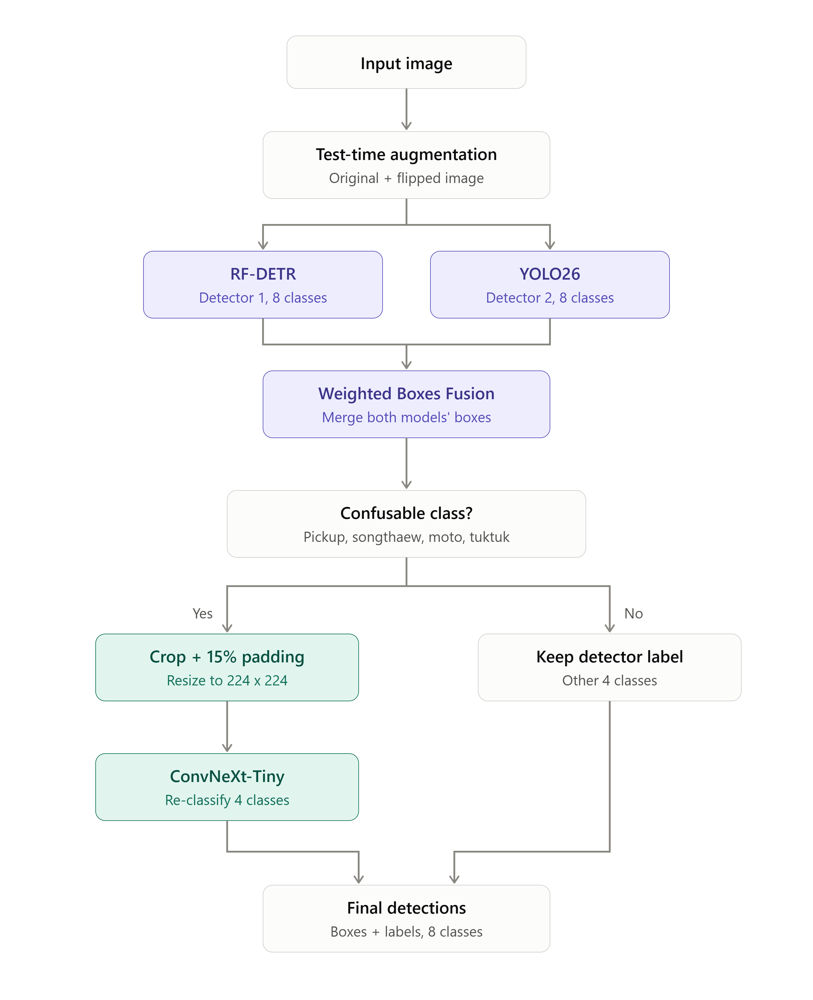

# Bangkok CCTV Vehicle Detection

Take-home midterm for 2110531 Data Science and Data Engineering Tools (2026/1).
The task is 8-class vehicle detection on Bangkok (BMA) traffic camera images, scored on Kaggle with **mAP@50** (pycocotools).

**Result:** 0.707 mAP@50 on the Kaggle public leaderboard (`submissions/wbf_final_ext_a0.4.csv`), with the
classifier also trained on external data; 0.703 without it (`submissions/wbf_final_c8big_a0.4.csv`).
The full write-up (data handling, both rounds, ablations) is in [docs/report.md](docs/report.md); the external
datasets and every keep/drop decision are in [docs/external_data.md](docs/external_data.md).

## Contents

1. [Dataset](#1-dataset)
2. [Pipeline](#2-pipeline)
3. [Setup](#3-setup)
4. [Step by step](#4-step-by-step)
5. [Comparing stages (ablation)](#5-comparing-stages-ablation)
6. [Configuration](#6-configuration)
7. [Project structure](#7-project-structure)

## 1. Dataset

| Item | Value |
|---|---|
| Source | BMA Traffic CCTV, one frame every 30 minutes, 25–31 Aug 2026, 06:00–21:00 |
| Image size | 352 × 288 px (all images) |
| Classes | 8 |
| Train images | 2,991 (2,889 with boxes, 102 without any box, used as background examples) |
| Test images | 1,013 (997 are listed in `sample_submission.csv`) |
| Labelled boxes | 27,396 (average 9.5 per image, maximum 48) |
| Cameras | 15 in train, 5 different ones in test (1068, 1072, 1192, 1439, 227) |

**Train / validation / test split.** Validation is taken from the labelled training images by holding out whole cameras (**1066, 1427, 172**), because the test set uses cameras that never appear in train.

| ID | Class | All train boxes | Train split | Val split | Test* |
|---|---|---|---|---|---|
| 0 | Car | 17,762 | 15,282 | 2,480 | – |
| 1 | Motorcycle | 6,563 | 5,172 | 1,391 | – |
| 2 | Bus | 482 | 415 | 67 | – |
| 3 | Truck | 1,356 | 1,072 | 284 | – |
| 4 | Tuktuk | 265 | 221 | 44 | – |
| 5 | Van | 354 | 323 | 31 | – |
| 6 | Pickup | 497 | 383 | 114 | – |
| 7 | Songthaew | 117 | 93 | 24 | – |
| | **Images** | **2,991** | **2,388** | **603** | **1,013** |
| | **Cameras** | **15** | **12** | **3** | **5** |

\* **The test set has no labels, so it cannot be evaluated locally.** It is used only to create the submission and is scored on Kaggle against hidden labels (997 of its 1,013 images are scored). The validation split is the local stand-in for the Kaggle score.

Things to know about the data:
- **Objects are very small.** 80% of cars and 97% of motorcycles are under 32 × 32 px (median motorcycle box: 7 × 17 px).
- **Classes are very unbalanced.** Car and Motorcycle make up 89% of boxes, but mAP@50 averages all 8 classes equally.
- **Songthaew comes mostly from one camera.** 91 of its 117 boxes are from camera 1426.

## 2. Pipeline



| Stage | What it does | Script |
|---|---|---|
| Detector 1: **RF-DETR Large** | Transformer detector, 8 classes | `train_rfdetr.py` |
| Detector 2: **YOLO26m** | CNN detector, 8 classes; makes different mistakes than RF-DETR | `train_yolo.py` |
| **Flip TTA** | Each detector also predicts on the mirrored image; boxes are mirrored back | `predict_detector.py` |
| **Remove duplicates (NMS)** | Per model and class, before fusion | `fuse.py` |
| **Weighted Boxes Fusion** | Merges all 4 prediction sets (2 models × original/flipped) into one, RF-DETR weighted 2, YOLO 1 | `fuse.py` |
| **ConvNeXt-Tiny classifier** | Knows all 8 classes; looks again at boxes labelled Car / Truck / Bus / Pickup / Songthaew / Van and adds a second guess (alpha 0.4) | `train_classifier.py`, `reclassify.py` |

The diagram is drawn by `docs/pipeline_diagram.py`.

Each stage writes its predictions to `preds/<name>/val.csv` and `test.csv`, so every stage can be scored on
its own and a stage is kept only if it raises the validation mAP50.

Two changes from the original design in `docs/pipeline.md`, both because of how mAP@50 is computed:

- **The classifier adds a second guess instead of replacing the label.** mAP ranks boxes by score, so a box can be
  sent twice: with the detector's label and with the classifier's label, each with its own score. A wrong
  second guess sits low in the ranking and costs almost nothing; a right one rescues a rare class.
  `--alpha` sets how much the classifier is trusted (0 = ignore it, 1 = trust it fully) and is tuned on validation.
- **Each model's own duplicate boxes are removed (NMS) before fusion.** Both detectors output many weak copies of the
  same object; without this step WBF averages them into the good box and the score drops (measured: 0.456 → 0.351).

## 3. Setup

```
conda env create -f environment.yml
conda activate vehicle-det
python -c "import torch; print(torch.cuda.is_available(), torch.cuda.get_device_name(0))"
```

PyTorch comes from the CUDA 12.8 wheels (needed for RTX 50-series; also runs on RTX 20/30/40).
For a GTX 10xx card change `cu128` to `cu126` in `environment.yml`.
The images and CSVs are in the repo (`original-data/`, `docs/`), so cloning is enough.

**Hardware used for training:** RTX 5090 (32 GB), Linux. The script defaults are set for it.
On an 8 GB GPU (tested on an RTX 4070 Laptop) add these flags:

| Script | Extra flags for 8 GB | Measured on 8 GB |
|---|---|---|
| `train_rfdetr.py` | `--batch 4 --grad-accum 4 --workers 2` | 5.2 GB, ~6 min/epoch |
| `train_yolo.py` | `--model yolo26m.pt --batch 8 --workers 4` | 5.8 GB, ~3 min/epoch |
| `train_classifier.py` | none | |

**Before a long run on a new machine**, train one epoch to check memory and time, then delete the test run:

```
python src/train_rfdetr.py --name _check --epochs 1      # watch max_mem and the epoch time
nvidia-smi                                               # in a second terminal while it runs
rm -rf runs/_check
```

## 4. Step by step

Run every command from the repo root with the `vehicle-det` environment active.
There are two rounds: **experiment** models (trained without the 3 validation cameras, used to measure and tune)
and **final** models (same settings, trained on all 15 cameras, used for Kaggle).

The epoch counts are short on purpose. Round 2 has no clean validation set, so it uses the **last** epoch;
in round 1, RF-DETR at 40 epochs peaked at epoch 6 and then lost 0.06 mAP50, while 12 epochs ends at its best
(details in `docs/report.md`, section 3.5).

### Round 1: experiment models (about 25 minutes on the RTX 5090)

```
python src/prepare_data.py                                    # datasets/yolo + datasets/rfdetr

python src/train_rfdetr.py --epochs 12 --name rfdl_e12                         # ~10 min
python src/train_yolo.py --model yolo26m.pt --epochs 25 --name y26m_e25        # ~8 min
python src/train_classifier.py --classes Car Motorcycle Bus Truck Tuktuk Van Pickup Songthaew \
    --samples-per-epoch 12000 --name cls_all8                                  # ~3 min

python src/predict_detector.py --weights runs/rfdl_e12/checkpoint_best_total.pth
python src/predict_detector.py --weights runs/y26m_e25/weights/last.pt --name y26m_e25_last
python src/fuse.py --runs rfdl_e12 y26m_e25_last --weights 2 1 --out wbf_new
python src/reclassify.py --preds wbf_new --classifier runs/cls_all8/best.pt \
    --apply-to Car Truck Bus Pickup Songthaew Van --alpha 0.2 0.4 --out wbf_new_c8big
python src/evaluate.py --preds wbf_new wbf_new_c8big_a0.2 wbf_new_c8big_a0.4   # val mAP50 0.676 / 0.683 / 0.688
```

`yolo26m.pt` is downloaded by Ultralytics on first use.

### Round 2: final models on all 15 cameras (about 25 minutes on the RTX 5090)

Same settings. `--patience 100` keeps early stopping off, and the last-epoch weights are used
(`last_ema.pth`, `last.pt`), because the validation cameras are now part of training.

```
python src/prepare_data.py --full                             # datasets/yolo_full + datasets/rfdetr_full

python src/train_rfdetr.py --data datasets/rfdetr_full --epochs 12 --name rfdl_e12_full
python src/train_yolo.py --model yolo26m.pt --data datasets/yolo_full/data.yaml --epochs 25 --patience 100 \
    --name y26m_e25_full
python src/train_classifier.py --full --classes Car Motorcycle Bus Truck Tuktuk Van Pickup Songthaew \
    --samples-per-epoch 12000 --name cls_all8_full

python src/predict_detector.py --weights runs/rfdl_e12_full/last_ema.pth --name rfdl_e12_full --splits test
python src/predict_detector.py --weights runs/y26m_e25_full/weights/last.pt --name y26m_e25_full --splits test
python src/fuse.py --runs rfdl_e12_full y26m_e25_full --weights 2 1 --out wbf_final --splits test
python src/reclassify.py --preds wbf_final --classifier runs/cls_all8_full/best.pt \
    --apply-to Car Truck Bus Pickup Songthaew Van --alpha 0.4 --splits test --out wbf_final_c8big
python src/make_submission.py --preds wbf_final_c8big_a0.4    # -> submissions/wbf_final_c8big_a0.4.csv (public 0.703)
```

**`image_id` must be the short test file name** (`1068_20260825_060110.jpg`), which `make_submission.py`
writes. The long Thai ids shown in `sample_submission.csv` score exactly 0 on Kaggle.

### External data for the classifier (public 0.707)

Nine Roboflow datasets, unzipped into `external-data/<set>/` (not in git; sources and class mapping in
`docs/external_data.md`). Only the crop classifier uses them; the detectors stay the Round 2 models above.

```
python src/prepare_external.py --classifier runs/cls_all8/best.pt   # -> datasets/external (12,308 images, 18,867 boxes)

python src/train_classifier.py --full --classes Car Motorcycle Bus Truck Tuktuk Van Pickup Songthaew \
    --samples-per-epoch 12000 --external datasets/external/external.csv --name cls_all8_ext_full
python src/reclassify.py --preds wbf_final --classifier runs/cls_all8_ext_full/best.pt \
    --apply-to Car Truck Bus Pickup Songthaew Van --alpha 0.4 --splits test --out wbf_final_ext
python src/make_submission.py --preds wbf_final_ext_a0.4      # -> submissions/wbf_final_ext_a0.4.csv (public 0.707)
```

The validation version (`train_classifier.py` without `--full`, then `reclassify.py --preds wbf_new ... --splits val`)
scores 0.705 against 0.688 without external data. Training the detectors on external CCTV frames
(`prepare_external_det.py`, `prepare_data.py --external`) was tested and not kept: no gain on validation.

## 5. Comparing stages (ablation)

```
python src/fuse.py --runs rfdl_e12 --no-tta --out rfdl_e12_wbf --splits val    # RF-DETR, duplicates removed
python src/fuse.py --runs rfdl_e12 --out rfdl_e12_tta --splits val             # + flip TTA
python src/evaluate.py --preds rfdl_e12 rfdl_e12_wbf rfdl_e12_tta y26m_e25_last wbf_new wbf_new_c8big_a0.4
```

`evaluate.py` prints one row per stage:
- **mAP50:** the 8-class mean, the same number Kaggle computes.
- **agnostic_AP50:** class ignored, so it measures box quality only. A large gap between this and mAP50 means the
  boxes are found but get the wrong class.
- **Per-class AP50.**
- **A confusion matrix** for the last stage listed: rows are the true classes, columns the predicted ones. It shows
  which classes get mixed up, which decides what the classifier should cover (`--classes` / `--apply-to`).

Fusion settings worth trying: `--weights 2 1` vs `1 1`, `--iou-thr 0.5 / 0.6 / 0.7`.
A smoke test with 1-epoch models confirmed each stage adds a little: RF-DETR 0.456 → + WBF 0.472 → + TTA 0.473 →
+ YOLO 0.485.

## 6. Configuration

| Setting | RF-DETR | YOLO26 | Classifier |
|---|---|---|---|
| Model | RF-DETR Large (DINOv2-S backbone, 34M params, COCO-pretrained at 704 px) | YOLO26m (COCO-pretrained) | ConvNeXt-Tiny (ImageNet-pretrained, `timm`), all 8 classes |
| Input | 704 px (images enlarged 2×, objects are tiny) | 704 px | box + 15% padding, resized to 224 |
| Epochs | 12 (`--epochs 12`; the script default of 40 overfits) | 25 (`--epochs 25`) | 15 × 12,000 crops |
| Batch | 16, lr 1e-4 (backbone 1.5e-4) | 16 (Ultralytics accumulates to an effective 64) | 64 |
| LR schedule | cosine, 1 warm-up epoch (default "step" would never decay) | cosine | one-cycle |
| Augmentation | h-flip, brightness/contrast, colour shift (day/night/rain); no rotation or v-flip | mosaic (off last 10 epochs), h-flip, HSV, milder zoom (`scale` 0.3) | random box shift/resize, h-flip, colour jitter |
| Imbalance | repeat-factor oversampling in `prepare_data.py` | same | rare classes sampled more (`--balance 0.5`) |
| Weights used | EMA; round 2: last epoch (`last_ema.pth`) | round 2: last epoch (`last.pt`) | best val epoch; round 2: last epoch |

**Oversampling.** `prepare_data.py` copies every train image that contains a rare class 2–4 times
(repeat-factor sampling, `--repeat-thr 0.3`). All boxes in a copied image stay labelled, so no vehicle is
turned into background; validation images are never copied. Songthaew appears in only 38 train images, so
its boxes go from 93 to 372; Tuktuk, Van and Pickup roughly double. The train split grows from 2,388 to 3,178 images.

Prediction uses a very low score threshold (0.001): low-scored boxes are ranked last, so they cannot lower AP.
Submissions keep at most 100 boxes per image (pycocotools ignores the rest). Every run saves its settings
(`runs/<name>/args.yaml` for YOLO, `runs/<name>/training_config.json` for RF-DETR).

## 7. Project structure

```
docs/                    competition PDF, train.csv, sample_submission.csv, pipeline design,
                         report.md (results write-up), external_data.md (external datasets),
                         figures/ (error analysis), pipeline_diagram.py (draws the pipeline PNG)
original-data/           Kaggle train and test images
src/
  common.py              paths, class names, validation cameras, scoring helpers
  prepare_data.py        train.csv -> YOLO and RF-DETR datasets (--external adds external frames)
  prepare_external.py    Roboflow sets in external-data/ -> datasets/external (our 8 classes)
  prepare_external_det.py  external CCTV images -> tiled 352x288 detector frames (tested, not used)
  train_rfdetr.py        detector 1
  train_yolo.py          detector 2
  train_classifier.py    crop classifier
  predict_detector.py    raw predictions (+ flipped) for val and test
  fuse.py                Weighted Boxes Fusion
  reclassify.py          classifier second stage
  evaluate.py            local mAP@50, ablation table, confusion matrix
  make_submission.py     Kaggle CSV
datasets/ runs/ preds/   generated (not in git)
external-data/           Roboflow downloads (not in git)
submissions/             submitted CSVs
environment.yml          conda environment
```
